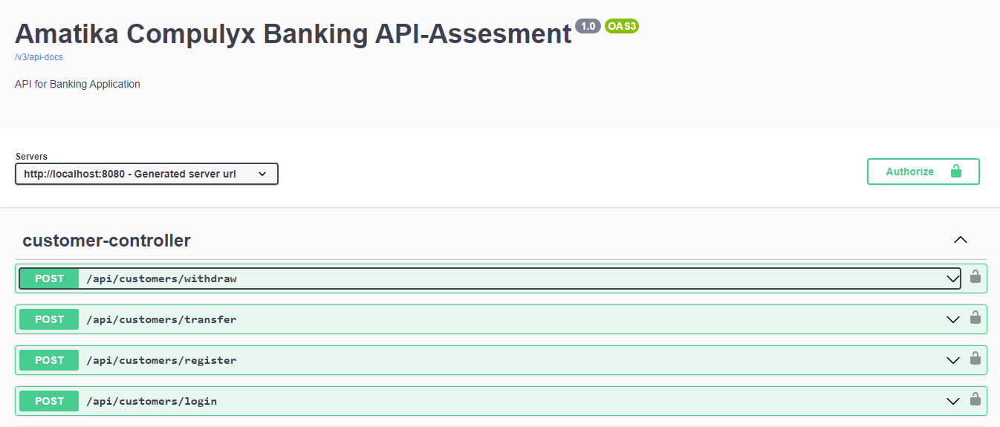

# Spring Boot Banking API Application

## Overview

This is a Spring Boot API application designed to provide a set of RESTful services for managing customer accounts, transactions, and authentication. 
The application is built with Spring Boot, secured with JWT authentication, and includes comprehensive API documentation with Swagger.

## Features

- **RESTful API**: Offers a range of endpoints for managing customers, accounts, and transactions.
- **JWT Authentication**: Secure API endpoints with JSON Web Tokens (JWT).
- **Database Integration**: Uses H2 for data storage.
- **API Documentation**: Interactive API documentation available with Swagger UI.
- **Exception Handling**: Custom exception handling for better error management.
- **Testing**: Unit and integration tests are included for key functionalities.

## Prerequisites

Before running this application, ensure you have the following installed:

- **Java 17** or higher
- **Maven** 
- **H2 for in-memory database** 
- **Spring Boot 3.x**

## Getting Started

### Clone the Repository

```bash
git clone https://github.com/amatika/BankingAPI_SpringBoot.git
Open the the project in eclipse and run
```
## Accessing the Application

- **API Documentation:**:  Once the application is running, you can access the Swagger UI at http://localhost:8080/swagger-ui.html..
- **Base URL:**: The base URL for the API will be http://localhost:8080/api/customers/ 

## Screenshots
Here are some screenshots of the project:

- **API Documentation (Swagger UI)**


